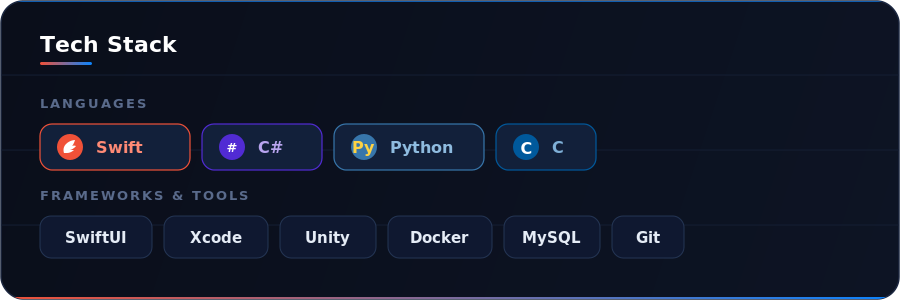
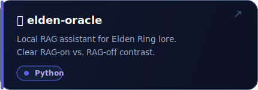
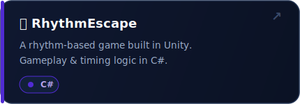
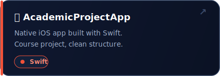
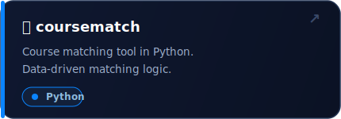

  

 

---

## About Me

I'm a Computer Engineering student at **Dumlupınar University (Kütahya)**, focused on writing clean, understandable code and turning ideas into working applications. I care about solid architecture, clear version control, and documenting the decisions — and mistakes — behind what I build.

- 🎓 &nbsp; Computer Engineering Student @ Dumlupınar University
- 📱 &nbsp; Building **iOS apps** with **Swift / SwiftUI**
- 🎮 &nbsp; Also into game dev with **Unity (C#)**
- 🧩 &nbsp; I love solving problems step by step
- 🚀 &nbsp; Goal: become a versatile, well-rounded software developer
- ✍️ &nbsp; I write about dev & CS on [Medium](https://medium.com/@canercakalofficial)

---

## Tech Stack

  

---

## GitHub Activity

  

---

## Featured Projects

---

## Contribution Snake

---

*"Code, learn, improve, repeat."*

