  

# Hi, I'm Caner

**Computer Engineering Student** · **iOS Developer Candidate (Swift)**

*Building projects, learning by doing, improving step by step.*

---

### About Me

I'm a Computer Engineering student focused on writing clean, understandable code and turning ideas into working applications. I care about solid architecture, clear version control, and documenting the decisions — and mistakes — behind what I build.

- 🎓 &nbsp; Computer Engineering Student @ Dumlupınar University
- 📱 &nbsp; Mostly building with **Swift / iOS** — also into game dev with **Unity (C#)**
- 🧩 &nbsp; I love solving problems step by step
- 🚀 &nbsp; Goal: become a versatile, well-rounded software developer
- ✍️ &nbsp; I write about dev & CS on [Medium](https://medium.com/@canercakalofficial)

---

### Tech & Tools

**Languages**

**Frameworks & Tools**

---

### GitHub Stats

---

### Featured Projects

> 🧠 **elden-oracle** — a locally-running RAG assistant answering Elden Ring lore, with a clear RAG-on vs. RAG-off contrast (sourced answers vs. hallucination).
> 🎮 **RhythmEscape** — a Unity (C#) game project.
> 📱 **AcademicProjectAppwithSwift** — an iOS app built in Swift for a course project.
> 🐍 **coursematch** — a Python project.

---

### Contribution Snake

---

*"Code, learn, improve, repeat."*

